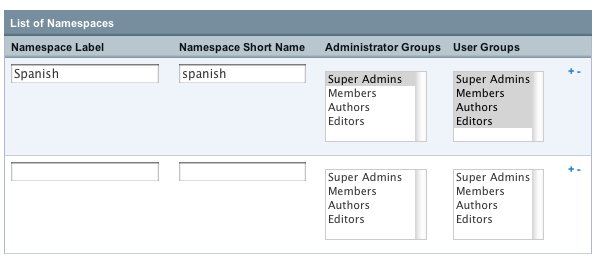

Wiki Control Panel
==================

After the initial setup in the Control Panel, all page creation and
editing is handled through the Wiki itself. This means your users do not
need Control Panel access to create new pages and edit pages on your
wiki. See `Using the Wiki <wiki_syntax.html>`_ for more information.

Creating Wikis
--------------

The Wiki Module Control Panel will display a list of all your wikis. To
create a new wiki click **Create Wiki** in the upper right. Fill in all
the preferences for the wiki and click update to finish creating the
wiki.

Control Panel Preferences
-------------------------

Full Wiki Name
~~~~~~~~~~~~~~

This is the descriptive name of your wiki that will be displayed on your
site.

The Full Wiki Name is a required field. Spaces, punctuation, and other
special characters are allowed. For example, the wiki's descriptive name
might be "Joe's Wiki."

Short Wiki Name
~~~~~~~~~~~~~~~

This is the name used internally within ExpressionEngine. For example,
you will use the Short Wiki Name in your ExpressionEngine template to
specify which wiki you want displayed. It is not normally shown to
visitors or otherwise exposed outside of the Control Panel.

The wiki's short name is a required field. It must be a single word with
no spaces. The underscore character is allowed. For example, if your
wiki's Full Name is "Joe's Wiki" your Short Name might be "joes\_wiki."

Text Formatting for articles
~~~~~~~~~~~~~~~~~~~~~~~~~~~~

You can use any of the text formatting
`plugins <http://plugins.expressionengine.com/>`_ available for
ExpressionEngine including **xhtml**, **Textile**, and **Markdown**.

To create pages, categories, and learn more about typically wiki use
please see the `Wiki syntax <wiki_syntax.html>`_ documentation.

File Upload Directory for Wiki
~~~~~~~~~~~~~~~~~~~~~~~~~~~~~~

You can use any existing upload directory for the wiki or create a new
one.

**Note:** The server path for your wiki's File Upload Directory must use
a full server path.

Administrator Groups
~~~~~~~~~~~~~~~~~~~~

Admins can Moderate, Lock, and Delete wiki articles in addition to all
the User Group priviliges. Please see the `Wiki
Users <wiki_users.html>`_ section for details.

User Groups
~~~~~~~~~~~

These Member Groups have access to the wiki. They can add and edit
articles and categories. Please see the `Wiki Users <wiki_users.html>`_
section for details.

Number of Revisions to Keep Per Article
~~~~~~~~~~~~~~~~~~~~~~~~~~~~~~~~~~~~~~~

When an article is modified a revision is kept automatically to create a
history for that article. You can limit the number of revisions kept to
cut down on database usage.

Number of Edits Allowed per Author Per Day
~~~~~~~~~~~~~~~~~~~~~~~~~~~~~~~~~~~~~~~~~~

Some people love to write... too much. Limit the number of times a
person can modify an article in a 24 hour period.

Email Addresses for Moderation Notifications
~~~~~~~~~~~~~~~~~~~~~~~~~~~~~~~~~~~~~~~~~~~~

When an article is moderated an email can be sent to alert Admins of the
changes. Please see the `Wiki Users <wiki_users.html>`_ section for
details.

Namespaces
----------

Namespaces are set on a per wiki basis and allow you to divide your
content up into logical, semantic divisions while also placing
restrictions on who can edit and administer that content.

For example if you had a wiki dedicated to learning languages you might
have a *Spanish* namespace and a *German* namespace as a way to organize
and separate your content. You could have a different Member Group as
the admin for each namespace.

Please see the `Wiki Syntax,
Namespaces <wiki_syntax.html#syntax_namespaces>`_ section for
information on using namespaces on your wiki after configuring them.

Setting up Namespaces
~~~~~~~~~~~~~~~~~~~~~

You can setup your wiki's namespaces from the wiki's control panel. For
each namespace, create a Label (displayed on the wiki pages) and a short
name (used internally and in certain forms for referencing the
namespace).

Your short name should only contain word characters like letters,
numbers, and underscores. Remember to set access permissions for these
Namespaces as they override those set for the general wiki. You can see
an example in the screen shot below.

|Create Namespace form.|
If you wish to delete a namespace, click the minus sign on the right
side of its row. To add a new namespace row, click any of the plus signs
and a new, empty row will be created for you.

**Note:** When you delete a namespace, the articles will still exist in
the database but since their Namespace is gone they will no longer be
accessible via the wiki. If you ever recreate the namespace with the
same short name and label, the articles will once again be accessible.

