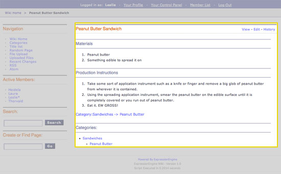
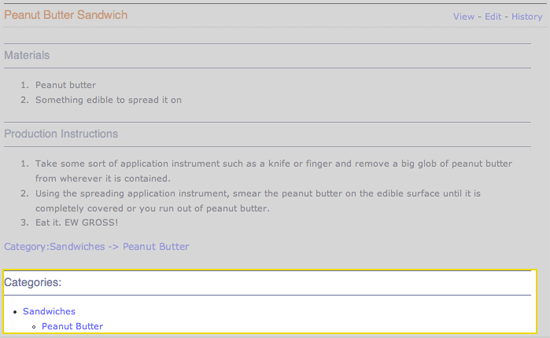
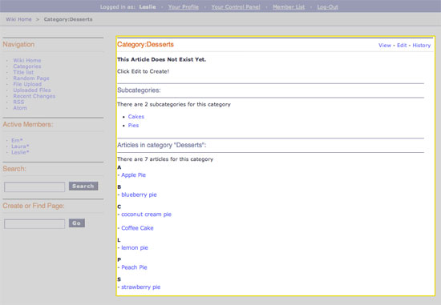

Wiki Article Template
=====================

This template determines how an article is displayed within the Wiki
Page wrapper template as outlined below:

|The Wiki Article template determines the visual display of articles as
highlighted below.|
In addition to the variables in the `Wiki Page
template <wiki_templates_page.html>`_, the Article template has:

Single Variables
----------------

article
~~~~~~~

::

	{article}

This variable displays the fully rendered article's text.

author
~~~~~~

::

	{author}

Displays the screen name of the member who wrote the current version of
article.

revision\_date
~~~~~~~~~~~~~~

::

	{revision_date format=""}

When a revision of an article is displayed this shows the date of the
revision being viewed.

The **format** parameter is used to determine the date's formatting
using ExpressionEngine's `Date Variable
Formatting <../../templates/date_variable_formatting.html>`_. For
example, this::

	Revised: {revision_date format="%D, %F %d, %Y - %g:%i:%s"}

Would render this::

	Revised: Mon, January 15, 2006 - 10:23:45

Conditional Variables
---------------------

There is only one conditional variable available to the Wiki Article
template.

if categories
~~~~~~~~~~~~~

::

	{if categories}

Checks to see if the currently displayed article has been assigned to
any categories. If it is, the `Special Category Tags <#special>`_ can be
used to display the categories on the article page.

Special Category Tags
---------------------

If an article is assigned to one or more categories you can use the
`{wiki:categories} <wiki_templates_special_categories.html#wiki_tag_categories>`_
tag to display the categories beneath the article as outlined below:

|If an article has categories you can display them beneath the article.|

Special Category Namespace
--------------------------

In the "Category" **Namespace** you also have the ability to create a
list of articles that are assigned to a specific category as outlined
below:

|Displays all the articles in a category.|

**Note:** A **Namespace** is a way to organize content by a special
keyword (the "namespace") that is not a title, topic, or category name.
For example, the wiki currently uses, by default, namespaces called
**Special**, **File**, and **Category** to organize wiki content.

Namespace features will be expanded on in future versions. In the
current verison you can use the **Category Namespace** in the Article
Template to create a list of articles that are assigned to a specific
category.

This is done by using the special **{if namespace == 'Category'}**
conditional and a combination of the
`{wiki:category\_subcategories} <wiki_templates_special_categories.html#wiki_tag_category_subcategories>`_
and
`{wiki:category\_articles} <wiki_templates_special_categories.html#wiki_tag_category_articles>`_
tags described in the `Special
Categories <wiki_templates_special_categories.html>`_ section of the
Wiki documentation.

