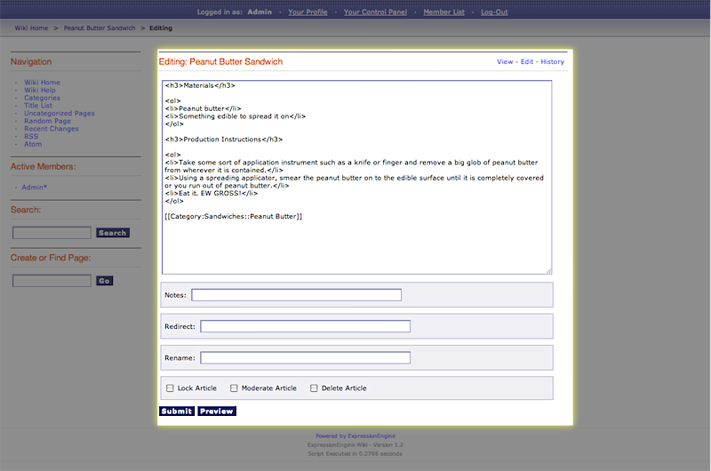

Wiki Edit Template
==================

This template determines how an article's editing interface (what
happens when a user clicks an 'edit' link) is displayed within the Wiki
Page wrapper template as outlined below:

|Dislays the editing interface for an article|
In addition to the variables in the `Wiki Page
template <wiki_templates_page.html>`_, the Edit template has:

Single Variables
----------------

content
~~~~~~~

::

	{content}

Displays the originally submitted content for the article with no
processing or formatting.

redirect page path
~~~~~~~~~~~~~~~~~~

::

	{path:redirect_page}

The URL path to the redirect page, if one is specified for the article.

preview
~~~~~~~

::

	{preview}

Displays the preview of submitted content for the article with complete
formatting.

redirect page
~~~~~~~~~~~~~

::

	{redirect_page}

The redirect page, if one is specified for the article.

Conditional Variables
---------------------

if moderated
~~~~~~~~~~~~

::

	{if moderated}

Checks to see if the article is moderated.

if old\_revision
~~~~~~~~~~~~~~~~

::

	{if old_revision}

Checks to see if a "old" (not the most current) revision of an article
is being edited. Old revisions can be edited and submitted as fresh
revisions.

if locked
~~~~~~~~~

::

	{if locked}

Check to see if the article is locked. This is used when an admin is
editing an article.

if preview
~~~~~~~~~~

::

	{if preview}

Check to see if a preview is being shown.

Form Variables
--------------

form\_declaration:wiki:edit
~~~~~~~~~~~~~~~~~~~~~~~~~~~

::

	{form_declaration:wiki:edit}

This variable is used to create the necessary opening **<form>** tag
with hidden fields to display the edit textarea.

Tags
----

The Wiki Edit Template can also use the **{wiki:files}** tag as
described in the `Special Files <wiki_templates_special_files.html>`_
section. This is used to display a list of the wiki's uploaded files in
the edit interface as outlined below:

|Dislays the wiki's uploaded files in the editing interface|

.. |Dislays the wiki's uploaded files in the editing interface| image:: ../../images/wiki_edit_files.gif
