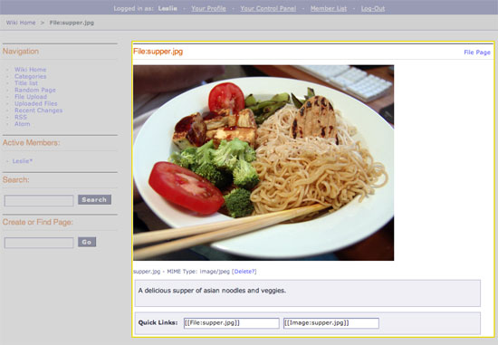

Wiki File Template
==================

This template displays the information about a single file that has been
uploaded to the wiki as outlined below:

|Displays the information on a single uploaded file.|

In addition to the variables in the :doc:`Wiki Page
template <wiki_templates_page>`, the Special Single File template
has:

Single Variables
----------------

file\_name
~~~~~~~~~~

::

	{file_name}

Displays the file's File name.

file\_type
~~~~~~~~~~

::

	{file_type}

Displays the file's MIME Type.

summary
~~~~~~~

::

	{summary}

Displays the file's summary.

path:view\_file
~~~~~~~~~~~~~~~

::

	{path:view_file}

Displays the URL to view a file's page. This is not the raw path to the
file.

upload date
~~~~~~~~~~~

::

	{upload_date format=""}

Displays the date the file was uploaded.

The **format** parameter is used to determine the date's formatting
using ExpressionEngine's `Date Variable
Formatting <../../templates/date_variable_formatting.html>`_.

author
~~~~~~

::

	{author}

Displays the Screen Name of the person who uploaded the file.

email
~~~~~

::

	{email}

This displays the email address of the person who uploaded the file.

url
~~~

::

	{url}

This displays the author's URL.

path:author\_profile
~~~~~~~~~~~~~~~~~~~~

::

	{path:author_profile}

Displays the path to the member profile of the person who uploaded the
file.

Conditional Variables
---------------------

if is\_image
~~~~~~~~~~~~

::

	{if is_image}

Checks to see if the uploaded file is an image. If yes, then do
something.

