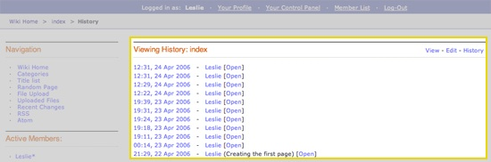

Wiki History Template
=====================

This template determines how an article's revision history is displayed
within the Wiki Page wrapper template as outlined below:

|The Wiki History Template determines the visual display of an article's revision history as highlighted below.|

In addition to the variables in the :doc:`Wiki Page
template <wiki_templates_page>`, the History template has:

Conditional Variables
---------------------

if no\_history
~~~~~~~~~~~~~~

::

	{if no_history}

Checks to see if the article has a revision history. If it doesn't,
display the information between this conditional.

if history
~~~~~~~~~~

::

	{if history}

Checks to see if the article has a revision history. If it does, display
the information in this conditional. This is used in combination with
the `{wiki:revisions} <#tag>`_ tag.

Tags
----

The History template uses the **{wiki:revisions}** tag which is used for
displaying an article's revisions. The tag has
`Single <#revisions_sin>`_ and `Conditional <#revisions_con>`_ variables
available.

{wiki:revisions} \| Single Variables
~~~~~~~~~~~~~~~~~~~~~~~~~~~~~~~~~~~~

count
^^^^^

::

	{count}

"count" of the file currently being displayed

path:open\_revision
^^^^^^^^^^^^^^^^^^^

::

	{path:open_revision}

Displays the URL to Open the revision.

**Note:** Opening a revision approves it and makes it live.

path:close\_revision
^^^^^^^^^^^^^^^^^^^^

::

	{path:close_revision}

Displays the URL that will close a revision.

revision author
^^^^^^^^^^^^^^^

::

	{revision_author}

Displays the Screen Name of Author of this revision.

revision date
^^^^^^^^^^^^^

::

	{revision_date format=""}

When a revision of an article is displayed this shows the date of the
revision being viewed.

The **format** parameter is used to determine the date's formatting
using ExpressionEngine's `Date Variable
Formatting <../../templates/date_variable_formatting.html>`_. For
example, this::

	Revised: {revision_date format="%D, %F %d, %Y - %g:%i:%s"}

Would render this::

	Revised: Mon, January 15, 2006 - 10:23:45

revision notes
^^^^^^^^^^^^^^

::

	{revision_notes}

Displays any notes submitted for this revision.

revision status
^^^^^^^^^^^^^^^

::

	{revision_status}

Displays the revision's status (open or closed).

switch=
^^^^^^^

::

	{switch="option_one|option_two|option_three"}

This variable permits you to rotate through any number of values as the
articles are displayed. The first article will use "option\_one", the
second will use "option\_two", the third "option\_three", the fourth
"option\_one", and so on.

Multiple instances of the {switch=} tag may be used and the system will
intelligently keep track of each one.

{wiki:revisions} \| Conditional Variables
~~~~~~~~~~~~~~~~~~~~~~~~~~~~~~~~~~~~~~~~~

if notes
^^^^^^^^

::

	{if notes}

Checks to see if revision notes exist for this revision.

if revision status
^^^^^^^^^^^^^^^^^^

::

	{if revision_status}

Checks to see if the revision's status. The possible values are:

-  **open**: Checks to see if a revision is "open".
-  **closed**: Checks to see if a revision is "closed".

This is used in combination with the
`{path:open\_revision} <#var_sin_path_open_revision>`_ and
`{path:close\_revision} <#var_sin_path_close_revision>`_ variables to
create an easy way for Admins to "open" and "close" a revision.

For example, if you are viewing a article's revision and the status of
revision is **closed** then the following::

	 {if revision_status == 'closed'} [<a href="{path:open_revision}">Open Revision</a>] {/if}   {if revision_status == 'open'} [<a href="{path:close_revision}">Close Revision</a>] {/if}

Would render this::

	 [<a href="http://example.com/index.php/wiki/index/revision/25/open/">Open Revision</a>]

