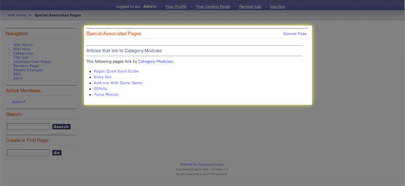

Wiki Special Associated Pages Template
======================================

This template displays a list of pages that link to the current article
as outlined below:

|Wiki Associated Pages|

In addition to the variables in the `Wiki Page
template <wiki_templates_page.html>`_, the Special Associated Pages
template has:

Variable Pairs
--------------

header
~~~~~~

::

	 {header} content before listing articles. {/header}

This variable will display content before the articles are listed.

footer
~~~~~~

::

	 {footer} content after listing articles. {/footer}

This variable will display content after the articles are listed.

Conditional Variables
---------------------

if no\_results
~~~~~~~~~~~~~~

::

	{if no_results}

Test if there are any results. This is typically used display alternate
content if there are no associated pages.

Single Variables
----------------

article\_title
~~~~~~~~~~~~~~

::

	{article_title}

Displays the page title of the originating article.

count
~~~~~

::

	{count}

"count" of the article currently being displayed

path:view\_article
~~~~~~~~~~~~~~~~~~

::

	{path:view_article}

Displays a URL to View Article.

path:view\_orig\_article
~~~~~~~~~~~~~~~~~~~~~~~~

::

	{path:view_orig_article}

Displays a URL to View the original article.

switch=
~~~~~~~

::

	{switch="option_one|option_two|option_three"}

This variable permits you to rotate through any number of values as the
articles are displayed. The first article will use "option\_one", the
second will use "option\_two", the third "option\_three", the fourth
"option\_one", and so on.

Multiple instances of the {switch=} tag may be used and the system will
intelligently keep track of each one.

title
~~~~~

::

	{title}

Displays the title of an article.

