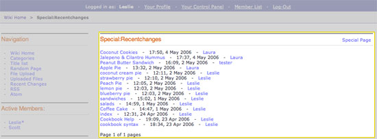

Wiki Special Recent Changes Template
====================================

This template displays a list of all recent changes to the wiki as
highlighted below:

|Displays the Wiki's Special Recent Changes page.|

In addition to the variables in the :doc:`Wiki Page
template <wiki_templates_page>`, the Special Recent Changes
template has:

Single Variables
----------------

gmt\_last\_updated
~~~~~~~~~~~~~~~~~~

::

	{gmt_last_updated format=""}

This displays the GMT time of the most recent wiki update.

The **format** parameter is used to determine the date's formatting
using ExpressionEngine's `Date Variable
Formatting <../../templates/date_variable_formatting.html>`_.

last\_updated
~~~~~~~~~~~~~

::

	{last_updated format=""}

Displays the localized time (for user) of the most recent wiki update.

The **format** parameter is used to determine the date's formatting
using ExpressionEngine's `Date Variable
Formatting <../../templates/date_variable_formatting.html>`_.

language
~~~~~~~~

::

	{language}

The language format being used.

Tags
----

The Special Recent Changes template has the **{wiki:recent\_changes}**
tag available which is used for displaying a list of recent wiki changes
and updates. The tag has `Parameters <#recent_para>`_ and
`variables <#recent_var>`_ available to it.

{wiki:recent\_changes} \| Parameters
~~~~~~~~~~~~~~~~~~~~~~~~~~~~~~~~~~~~

limit
^^^^^

::

	{wiki:recent_changes limit=""}

This determines how many recent changes are displays. For example, this::

	{wiki:recent_changes limit="20"}

Would limit the number of changes displayed to the 20 most recent
changes.

paginate
^^^^^^^^

::

	{wiki:recent_changes paginate=""}

This determines the placement of pagination. For example, if the
`limit <#tag_para_limit>`_ parameter is set to 20 and there are 55
changes, then you can use this parameter to create pagination to browse
all the changes.

The values for the paginate parameter are:

-  **top**: pagination is placed on top.
-  **bottom**: pagination is placed on the bottom.
-  **both**: pagination is placed on the top and the bottom.

{wiki:recent\_changes} \| Variables
~~~~~~~~~~~~~~~~~~~~~~~~~~~~~~~~~~~

absolute\_count
^^^^^^^^^^^^^^^

::

	{absolute_count}

Running "count" of the displayed file, taking pagination into
consideration.

article
^^^^^^^

::

	{article}

Displays the fully rendered article. HTML characters will be rendered.

author
^^^^^^

::

	{author}

Displays the Screen Name of the revision's author.

content
^^^^^^^

::

	{content}

Displays the raw content of an article.

count
^^^^^

::

	{count}

"count" of the article currently being displayed

email
^^^^^

::

	{email}

This displays the email address of the revision's author.

gmt\_revision\_date
^^^^^^^^^^^^^^^^^^^

::

	{gmt_revision_date format=""}

This displays the GMT time of the most recent article revision.

The **format** parameter is used to determine the date's formatting
using ExpressionEngine's `Date Variable
Formatting <../../templates/date_variable_formatting.html>`_.

page\_id
^^^^^^^^

::

	{page_id}

This is used to get the page's unique ID. This is used for identifying
purposes in RSS/Atom Feeds.

path:view\_article
^^^^^^^^^^^^^^^^^^

::

	{path:view_article}

Displays a URL to view the article.

revision\_date
^^^^^^^^^^^^^^

::

	{revision_date format=""}

This displays the time of the most recent article revision.

The **format** parameter is used to determine the date's formatting
using ExpressionEngine's `Date Variable
Formatting <../../templates/date_variable_formatting.html>`_.

revision\_id
^^^^^^^^^^^^

::

	{revision_id}

Displays the revision's unique ID number.

revision\_notes
^^^^^^^^^^^^^^^

::

	{revision_notes}

This displays the revision's notes (if any).

switch=
^^^^^^^

::

	{switch="option_one|option_two|option_three"}

This variable permits you to rotate through any number of values as the
recent changes are displayed. The first article will use "option\_one",
the second will use "option\_two", the third "option\_three", the fourth
"option\_one", and so on.

Multiple instances of the {switch=} tag may be used and the system will
intelligently keep track of each one.

title
^^^^^

::

	{title}

Displays the article/page's Title.

url
^^^

::

	{url}

This displays the author's URL.

