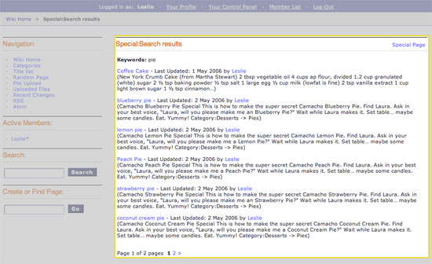

Wiki Special Search Results Template
====================================

This template displays wiki search results as outlined below:

|Displays search results done through the wiki.|

In addition to the variables in the :doc:`Wiki Page
template <wiki_templates_page>`, the Special Search Results
template has:

Conditional Variables
---------------------

if no\_results
~~~~~~~~~~~~~~

::

	{if no_results}

Checks to see there are search results. If not, do something.

if results
~~~~~~~~~~

::

	{if results}

Checks to see if there are search results. If yes, do something.

Single Variables
----------------

keywords
~~~~~~~~

::

	{keywords}

Displays the keywords used in the search.

Tags
----

The Special Search Results template has the **{wiki:search\_results}**
tag available which is used to display the search results. This tag has
`Parameters <#para>`_ and `Variables <#vars>`_ available to it.

{wiki:search\_results} \| Parameters
~~~~~~~~~~~~~~~~~~~~~~~~~~~~~~~~~~~~

limit
^^^^^

::

	{wiki:search_results limit="#"}

This determines the number of search results to display on a page. For
example, this: ``{wiki:search_results limit="10"}``

Would limit the number of search results displayed to 10.

paginate
^^^^^^^^

::

	{wiki:search_results paginate=""}

The Wiki module uses the same pagination syntax as all first-party
modules. Please look at the :doc:`/modules/channel/pagination_page`
documentation for more information.

switch
^^^^^^

::

	{wiki:search_results switch=""}

This is used to "switch" styles using css in combination with the
`switch variable <#search_sin_switch>`_. For example, this::

	 {wiki:search_results switch="blue|red"} 
a search result

Would render something like this::

	 
a search result
 
a search result
 
a search result
 
a search result

{wiki:search\_results} \| Variables
~~~~~~~~~~~~~~~~~~~~~~~~~~~~~~~~~~~

This tag only has single variables available.

absolute\_count
^^^^^^^^^^^^^^^

::

	{absolute_count}

Running "count" of the displayed file, taking pagination into
consideration.

article
^^^^^^^

::

	{article}

Displays the fully rendered article. HTML characters will be rendered.

author
^^^^^^

::

	{author}

Displays the Screen Name of the revision's author.

content
^^^^^^^

::

	{content}

Displays the raw content of an article.

count
^^^^^

::

	{count}

"count" of the article currently being displayed

email
^^^^^

::

	{email}

This displays the email address of the revision's author.

gmt\_revision\_date
^^^^^^^^^^^^^^^^^^^

::

	{gmt_revision_date format=""}

This displays the GMT time of the most recent article revision.

The **format** parameter is used to determine the date's formatting
using ExpressionEngine's :doc:`Date Variable Formatting
</templates/date_variable_formatting>`.

page\_id
^^^^^^^^

::

	{page_id}

This is used to get the page's unique ID. This is used for identifying
purposes in RSS/Atom Feeds.

path:view\_article
^^^^^^^^^^^^^^^^^^

::

	{path:view_article}

Displays a URL to view the article.

revision\_date
^^^^^^^^^^^^^^

::

	{revision_date format=""}

This displays the time of the most recent article revision.

The **format** parameter is used to determine the date's formatting
using ExpressionEngine's :doc:`Date Variable Formatting
</templates/date_variable_formatting>`.

revision\_id
^^^^^^^^^^^^

::

	{revision_id}

Displays the revision's unique ID number.

revision\_notes
^^^^^^^^^^^^^^^

::

	{revision_notes}

This displays the revision's notes (if any).

switch
^^^^^^

::

	{switch}

This is used in combination with the `switch
parameter <#search_para_switch>`_ to "switch" the css class being used
to display search results. Please see the `switch
parameter <#search_para_switch>`_ for example usage.

switch=
^^^^^^^

::

	{switch="option_one|option_two|option_three"}

This variable permits you to rotate through any number of values as the
results are displayed. The first article will use "option\_one", the
second will use "option\_two", the third "option\_three", the fourth
"option\_one", and so on.

Multiple instances of the {switch=} tag may be used and the system will
intelligently keep track of each one.

title
^^^^^

::

	{title}

Displays the article/page's Title.

url
^^^

::

	{url}

This displays the author's URL.

