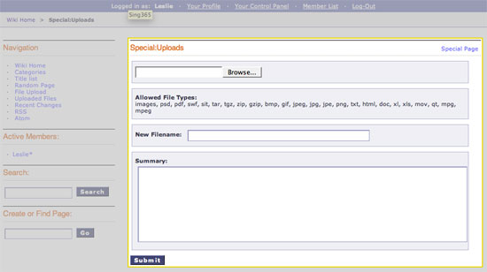

Wiki Special Upload Form Template
=================================

This template displays the wiki's upload form as outlined below:

|Displays the wiki's upload form.|
In addition to the variables in the `Wiki Page
template <wiki_templates_page.html>`_, the Special Upload Form template
has:

Single Variables
----------------

file\_types
~~~~~~~~~~~

::

	{file_types}

This displays the allowed file types that can be uploaded. The value is
determined by the settings of the File Upload Directory that the wiki is
using, which is set from the `Wiki's Control Panel <wiki_cp.html>`_.

Conditional Variables
---------------------

if file\_types
~~~~~~~~~~~~~~

::

	{if file_types == 'images'}

This checks to see if the Upload Directory specified in the `Wiki's
Control Panel <wiki_cp.html>`_ allows only images to be uploaded. This
is used in combination with the
`{file\_types} <#upload_sin_file_types>`_ variable to display what kind
of files can be uploaded. Please see the default theme file for an
example (search for {if file\_types == 'images'}).

Form Variables
--------------

form\_declaration:wiki:uploads
~~~~~~~~~~~~~~~~~~~~~~~~~~~~~~

::

	{form_declaration:wiki:uploads}

This creates the opening <form> tag and hidden fields needed for the
upload form.

