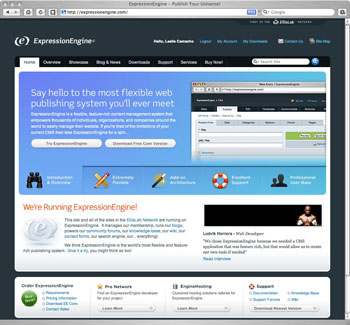
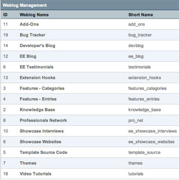

Channels
========

A Channel is Simply Information
-------------------------------

In ExpressionEngine terminology, a Channel is simply a container for
information stored in the database. This is a **very important
concept**, and is the basis for ExpressionEngine's flexibility to power
anything from complex news sites, corporate intranets, or even a simple
weblog.

A Channel is only the information, separate and independent from the
pages (which we refer to as Templates). There is no assumed relationship
between a Channel and one of your web pages. Several Channels can all
live happily on a single page. This lets you organize and present
information on your site with great flexibility.

**Important Concept:** A "Channel" in ExpressionEngine consists of only
information (entries, comments, preferences). Templates determine how
and where you display your Channel data. How you mix and match the two
is up to you.

Let's take a quick look at how we mix and match channels and templates
at `ExpressionEngine.com <http://expressionengine.com>`_.

|ExpressionEngine.com channel example|

--------------

|Channels at ExpressionEngine.com|

#. We use Templates to control a number of design elements, such as the
   main navigation and footer, across the entire site. If we need to
   alter one of these elements, we make a change to one Template and the
   entire site updates. Notice that this is not a Channel. Templates do
   not have to have channels and are quite powerful all by themselves.

#. The Showcase is managed through two channels. We use one for the
   `Showcase
   Interviews <http://expressionengine.com/showcase/interview_list/>`_
   and another channel for `Showcase
   websites <http://expressionengine.com/showcase/websites/>`_. This is
   a good example of how channel fields can turn a "channel" into
   exactly what's needed. For the interviews we use a field for the
   screen cap, title, and then a "main" field for the actual interview.
   The Showcase Websites channel field group has the name of the site,
   the url, and the title of the link using a customized field set.

#. Many of our support resources are actually "channels." For example,
   the ExpressionEngine.com `Sales
   FAQ <http://expressionengine.com/sales_faq/>`_ is actually a single
   channel that makes extensive use of categories. The Bug Tracker works
   in a similar fashion.
#. Of course, a channel can be just that, a traditional channel, such as
   our `ExpressionEngine Blog <http://expressionengine.com/blog/>`_.

#. ExpressionEngine offers really advanced features, such as allowing
   php in templates and Related Entries, which let you associate one
   channel entry with another.

These are just a few examples of what can be done with ExpressionEngine
Channels. Because ExpressionEngine makes no assumptions about the
placement or format of a Channel's content, you can present the content
of your Channels on your pages in thousands of ways, structured and
organized in a way that makes the most sense for your content.

Next: `Template Introduction <templates.html>`_
===============================================

