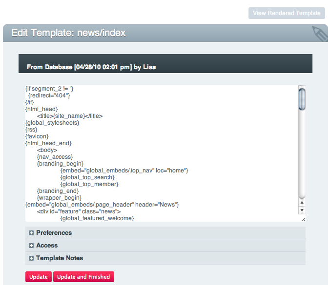

Template Introduction
=====================

What's in a Template
--------------------

**Note:** In addition to the information in this page, the Control Panel
section of the user guide has detailed `usage
information <../cp/design/templates/index.html>`_ regarding the
Templates Page.

In ExpressionEngine, a Template represents an HTML page on your site,
although unlike a traditional HTML page, there isn't an actual file on
your server. Instead, ExpressionEngine takes care of turning your
Templates into web pages when someone visits your site.

The benefit of this approach is that information can be presented
*dynamically* by using special Tags within your templates. The secondary
benefit of this approach is that your pages can be managed from within
the ExpressionEngine Control Panel using your web browser, so you no
longer need to use FTP to upload files to your server whenever a page
changes.

Your ExpressionEngine powered site will consist of, at minimum, one
Template, representing your site's "index" or "home" page. Most sites
have more than one Template, of course, but even the most basic site
must have at least one Template.

Usually, each of your Templates will represent an entire web page,
although it is possible to `embed
templates <../templates/embedding_templates.html>`_ within other
templates if you want to use common site elements in all your pages,
like headers or footers.

ExpressionEngine templates are managed from within your Control Panel
TEMPLATES page. Templates are organized into sets of templates called
Template Groups, which you can think of as a virtual folders. Your
Templates and Template Groups also help define your site's URL structure
- see `ExpressionEngine URLs <../general/urls.html>`_ for more
information.

**Important concept:** A Template in ExpressionEngine can be thought of
as a web page. A Template Group is a collection of related Templates,
much like a folder. Templates and Template Groups are managed from
within your Control Panel TEMPLATES page

|Template Example|
For the most part, a template looks very much like a standard HTML page.
What sets a Template apart, however, is that it can contain special
ExpressionEngine Tags that let you generate dynamic content within your
templates. Therefore, understanding how tags work is an important key to
getting the most out of your templates. ExpressionEngine Tags are
introduced next by clicking the link at the bottom of this page. In
addition, the `Getting Started
Tutorial <../getting_started/index.html>`_ will explore tags in more
detail.

**Important concept:** EE Tags are the means by which all of
ExpressionEngine's features can be utilized within your templates.

Viewing a Template
------------------

Because you don't actually have physical pages on your site, the URLs in
ExpressionEngine will determine what template is shown. At its simplest,
you will access pages using this URL formula::

	http://example.com/index.php/template_group/template/

So, if you want to show the "index" template within a Template Group
called "blog", you'll use a URL like this::

	http://example.com/index.php/blog/index/

The `ExpressionEngine URLs <../general/urls.html>`_ section has much
more detailed information regarding URLs.

Next: `Tag Introduction <tags.html>`_
=====================================

